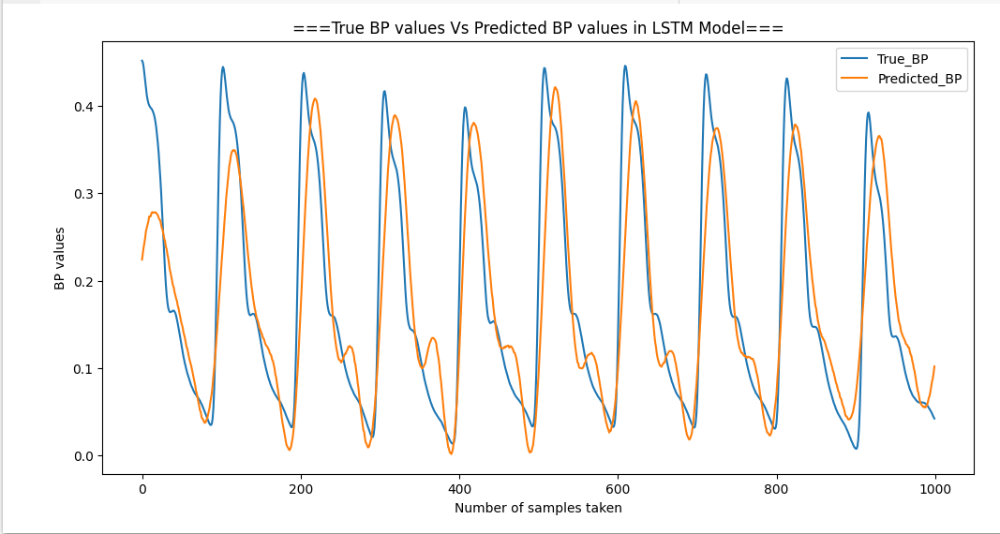
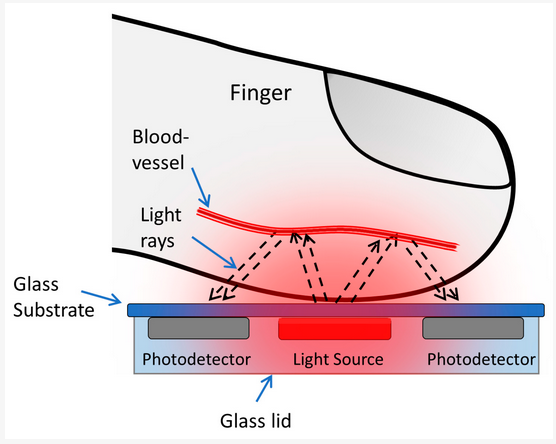

# Bp_prediction_deep_learning
LSTM Model for Blood Pressure Estimation via Photoplethysmography (PPG)

Photoplethysmography: (PPG) is a simple optical technique used to detect volumetric changes in blood in peripheral circulation.

